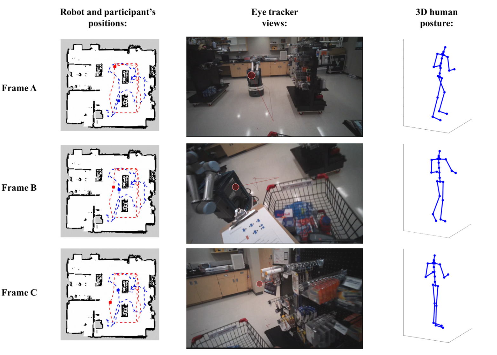

# UF Retail HRI Dataset

## Overview
The dataset was recorded in a future-orientated Wholesale and Retail Trade environment, where the robot was deployed to work alongside the human worker in close proximity. To simulate real-world scenarios, eight participants were tasked with order picking and sorting, as well as inventory checking. More than 260 minutes of data were collected via robot sensors, human motion capture, and eye gaze measurements. The following is an example figure depicting the integration of robot and human positions, human 3D posture, and eye-tracking data from a sample trial. It is our hope that the present dataset will enrich the open-source resources and promote not only studies on human reactions and behavior toward the co-bot, but also the research on safe robot control strategies and advanced Machine Learning models.


Images on the left column show the mapping of human and robot positions at different time frames in the trial. In the middle are the screenshots from the eye tracker at the corresponding frames. On the right column are the figures of the 3D human model created with Xsens MOCAP data. Frame A represents the participant’s first glance at the robot. Frame B represents the moment when the participant and the robot begin to avoid each other. Frame C shows the participant following the avoidance interaction, looking for an item on the shelf.

---

## Data

### 1. Participant Data Sheet
[The data is available here](https://drive.google.com/drive/folders/1MxfFcM2HyELjD30PSB8-rugwxGerSGs0?usp=sharing)

Data sheets for 8 participants are available in the dataset. Each data sheet contains information including the participant's age, gender, height (with shoes, cm), weight (kg), as well as the task condition and duration of each trial. Note that, in order to ensure that no physical collision would happen during the trials, the researcher assumed control of the robot when necessary. These instances were marked as “intervened” in the data sheets. 

### 2. Robot Sensor Data 
[The data is available here](https://drive.google.com/drive/folders/1VCCNtc3Q2Ze17ZGqW6EL3zLpvpnGsVo4?usp=sharing)

A total of 56 (40 order picking and sorting + 16 inventory checking) bag files are available in the dataset. All sensor data from the robot, including images from camera, point clouds from Lidar, measurements of acceleration and angular rate from IMU, and joint states from wheel encoders,  were recorded as the serialized ROS message data in the rosbag format. Note that, in order to perform online recordings, the images were recorded as 640 by 480p, which is sufficient to show the information from the first-person robot view.

### 3. Human Motion Capture Data
[The data is available here](https://drive.google.com/drive/folders/11kD9yYiS9oEJdhFkgM_LZH-CquVhg-5M?usp=sharing)

A total of 112 excel files are available in the motion capture data folder. Four trials were found to have poor data quality (i.e., off-axis), and the corresponding files were labeled as “offaxis”. The human motion data from Xsens contains over 930 thousand frames of full-body human posture information. The following human motions were observed frequently during the experiment: 1) picking up and putting down the item list, 2) pushing and pulling the shopping cart, 3) browsing through the shelf, 4) bending over and crouching, 5) picking up items from the shelf, 6) putting items into the bin, 7) writing on the checklist, 8) walking between shelves, 9) counting items, and 10) avoiding robot if necessary. Inside each participant folder, trial files contain the timestamp information and position data of 23 joints, including pelvis, L5, L3, T12, T8, neck, head, right and left shoulder, right and left upper arm,  right and left forearm, right and left hand, right and left upper leg, right and left lower leg, right and left foot, right and left toe.

### 4. Eye-tracking Data
[The data is available here](https://drive.google.com/drive/folders/1XMwLd4W3uMEcmzE32H_nVReS8xUo2pCZ?usp=sharing)

Eye-tracking data, such as gaze directions and eye movements, were saved in 112 excel files (8 participants x 14 trials). The collected data were exported with timestamp so that it can be further analyzed along with other measurements. In addition, a total of 112 videos (.MP4) recorded by the embedded scene camera are also available in the current dataset. 

---

## Citation

When using this dataset please cite the following paper in your work

```markdown
Currently unavailable
```

